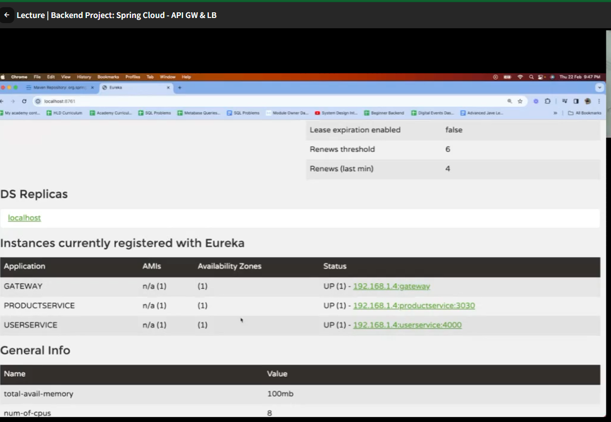

# ApiGatewayAndLoadBalancerMicroService

## Overview
ApiGatewayAndLoadBalancerMicroService is a Spring Boot project that provides an API Gateway and Load Balancer for microservices architectures. It leverages Spring Cloud Gateway MVC, Spring Cloud LoadBalancer, and Netflix Eureka for service discovery and routing.

## Features
- **API Gateway**: Central entry point for routing requests to backend microservices.
- **Load Balancing**: Distributes incoming requests across multiple service instances.
- **Service Discovery**: Integrates with Netflix Eureka for dynamic service registration and discovery.
- **Spring Boot 3.2.3**: Modern, production-ready Java application framework.

## Project Structure
```
ApiGatewayAndLoadBalancerMicroService/
├── src/
│   ├── main/
│   │   ├── java/org/example/apigatewayandloadbalancermicroservice/
│   │   │   └── ApiGatewayAndLoadBalancerMicroServiceApplication.java
│   │   └── resources/
│   │       └── application.properties
│   └── test/
│       └── java/org/example/apigatewayandloadbalancermicroservice/
│           └── ApiGatewayAndLoadBalancerMicroServiceApplicationTests.java
├── pom.xml
└── README.md
```

## Prerequisites
- Java 21+
- Maven 3.8+

---

## Step 1: Set Up Eureka Server
You need a Eureka server running for service discovery. You can use the [Spring Cloud Eureka Server guide](https://cloud.spring.io/spring-cloud-netflix/multi/multi_spring-cloud-eureka-server.html) or follow these steps:

1. **Generate a new Spring Boot project** with the dependency `spring-cloud-starter-netflix-eureka-server`.
2. **Add the Eureka Server annotation** to your main class:
   ```java
   @SpringBootApplication
   @EnableEurekaServer
   public class EurekaServerApplication {
       public static void main(String[] args) {
           SpringApplication.run(EurekaServerApplication.class, args);
       }
   }
   ```
3. **Add to `application.properties`:**
   ```properties
   server.port=8761
   eureka.client.register-with-eureka=false
   eureka.client.fetch-registry=false
   ```
4. **Run the Eureka server** (on port 8761 by default).

---

## Step 2: Configure the API Gateway

Edit `src/main/resources/application.properties` in this project to include:
```properties
# Eureka client configuration
spring.application.name=api-gateway
server.port=8080

# Eureka server URL
eureka.client.service-url.defaultZone=http://localhost:8761/eureka/

# Example route (for a service named 'example-service')
spring.cloud.gateway.routes[0].id=example-service
spring.cloud.gateway.routes[0].uri=lb://EXAMPLE-SERVICE
spring.cloud.gateway.routes[0].predicates[0]=Path=/example/**
```
- Replace `EXAMPLE-SERVICE` with the name of your backend service registered in Eureka.

---

## Step 3: Create a Sample Backend Service
You need at least one backend microservice registered with Eureka. Example steps:

1. **Generate a new Spring Boot project** with dependencies:
   - `spring-boot-starter-web`
   - `spring-cloud-starter-netflix-eureka-client`
2. **Add to `application.properties`:**
   ```properties
   spring.application.name=example-service
   server.port=8081
   eureka.client.service-url.defaultZone=http://localhost:8761/eureka/
   ```
3. **Add a sample controller:**
   ```java
   @RestController
   public class HelloController {
       @GetMapping("/hello")
       public String hello() {
           return "Hello from Example Service!";
       }
   }
   ```
4. **Run the backend service.**

---

## Step 4: Build and Run the API Gateway
1. **Build the project:**
   ```bash
   mvn clean install
   ```
2. **Run the application:**
   ```bash
   mvn spring-boot:run
   ```
   The gateway will start on port 8080.

---

## Step 5: Test the Setup
- With all three applications running (Eureka server, backend service, API gateway), access:
  - `http://localhost:8080/example/hello`
- You should see the response from your backend service via the gateway.

---

## Dependencies
Key dependencies from `pom.xml`:
- `spring-cloud-starter-gateway-mvc`: API Gateway functionality
- `spring-cloud-starter-loadbalancer`: Client-side load balancing
- `spring-cloud-starter-netflix-eureka-client`: Eureka service discovery
- `spring-boot-devtools`, `lombok`, `spring-boot-starter-test`: Development and testing utilities

## Testing
- The project includes a basic context load test in `ApiGatewayAndLoadBalancerMicroServiceApplicationTests.java`.
- Run tests with:
  ```bash
  mvn test
  ```

## License
This project is licensed under the MIT License.

## Author
- [Your Name]

# How to Run Everything

Follow these steps to run the full microservices demo:

## 1. Start Eureka Server
- Go to the `ServiceDiscovery-EurekaServer-` directory:
  ```bash
  cd ../ServiceDiscovery-EurekaServer-
  mvn spring-boot:run
  ```
- Visit [http://localhost:8761](http://localhost:8761) to verify the Eureka dashboard is running.

## 2. Start PaymentService (Backend Service)
- Open a new terminal and go to the `PaymentService` directory:
  ```bash
  cd ../PaymentService
  mvn spring-boot:run
  ```
- The service will register as `example-service` with Eureka and run on port 8081.

## 3. Start API Gateway
- Open another terminal and go to the `ApiGatewayAndLoadBalancerMicroService` directory:
  ```bash
  cd ApiGatewayAndLoadBalancerMicroService
  mvn spring-boot:run
  ```
- The gateway will register as `api-gateway` with Eureka and run on port 8080.

## 4. Test the Setup
- With all three applications running, access:
  - [http://localhost:8080/example/](http://localhost:8080/example/)
- You should see the response from PaymentService (e.g., `Hello`).

--- 

# Load Balancing in This Project

**Yes, load balancing is handled in your current setup!**

## How Load Balancing Works
- **Spring Cloud Gateway** is configured to use the `lb://` (load balancer) URI scheme for backend services:
  ```
  spring.cloud.gateway.routes[0].uri=lb://EXAMPLE-SERVICE
  ```
  This tells the gateway to use Spring Cloud LoadBalancer to route requests to any instance of the service registered as `EXAMPLE-SERVICE` in Eureka.

- **Eureka** acts as a service registry. If you run multiple instances of `PaymentService` (or any other service registered as `EXAMPLE-SERVICE`), all of them will be registered with Eureka.

- **Spring Cloud LoadBalancer** (included via your dependencies) will automatically distribute incoming requests from the gateway across all available instances of `EXAMPLE-SERVICE` using a round-robin algorithm by default.

---

## How to See Load Balancing in Action

1. **Start Multiple Instances of PaymentService**
   - Open multiple terminals.
   - In each, run `PaymentService` with a different port:
     ```bash
     mvn spring-boot:run -Dspring-boot.run.arguments=--server.port=8081
     mvn spring-boot:run -Dspring-boot.run.arguments=--server.port=8082
     ```
   - Make sure each instance has the same `spring.application.name=example-service` and points to the same Eureka server.

2. **Check Eureka Dashboard**
   - Go to [http://localhost:8761](http://localhost:8761)
   - You should see multiple instances of `EXAMPLE-SERVICE` registered.

3. **Send Multiple Requests to the Gateway**
   - Use your browser or a tool like `curl` or Postman to hit:
     ```
     http://localhost:8080/example/
     ```
   - You should see the requests being distributed (load balanced) across your running instances. You can add a unique response per instance to see the difference.

---

| Component         | Role                                 |
|-------------------|--------------------------------------|
| Eureka            | Service registry                     |
| PaymentService    | Registers as `example-service`       |
| API Gateway       | Uses `lb://EXAMPLE-SERVICE` URI      |
| Load Balancer     | Distributes requests across instances|

**In short:**
If you run multiple instances of your backend service, the API Gateway will automatically load balance requests between them using Spring Cloud LoadBalancer and Eureka. 